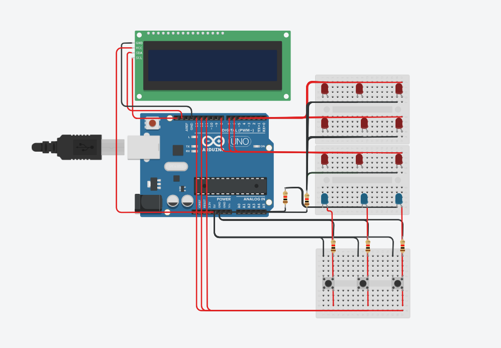

# Arduino reakcijos laiko žaidimas

Arduino reakcijos laiko žaidimas sukurtas naudojant tinkercad. Žaidimo tikslas surinkti kuo daugiau taškų atinkamų laikų paspaudžiant vieną iš trijų mygtukų pagal ateinančius LED užsižiebimus.

